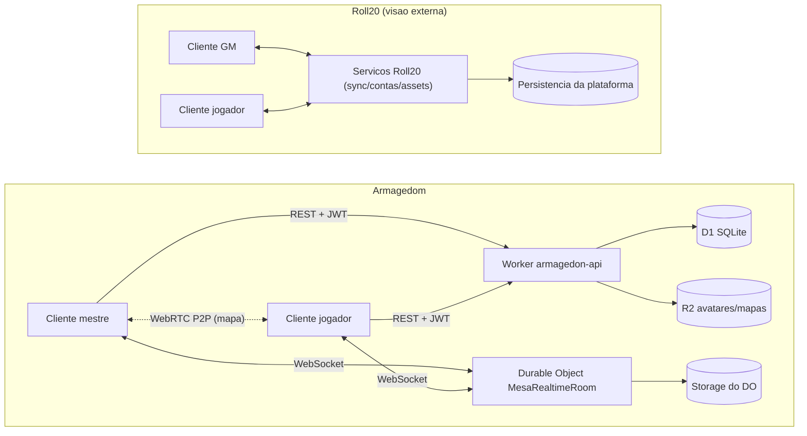
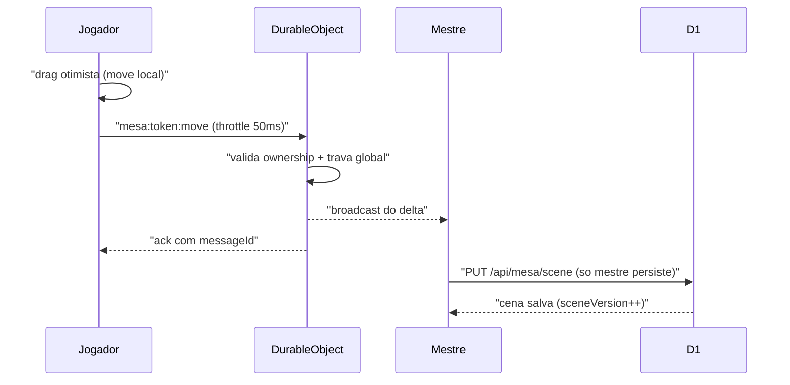
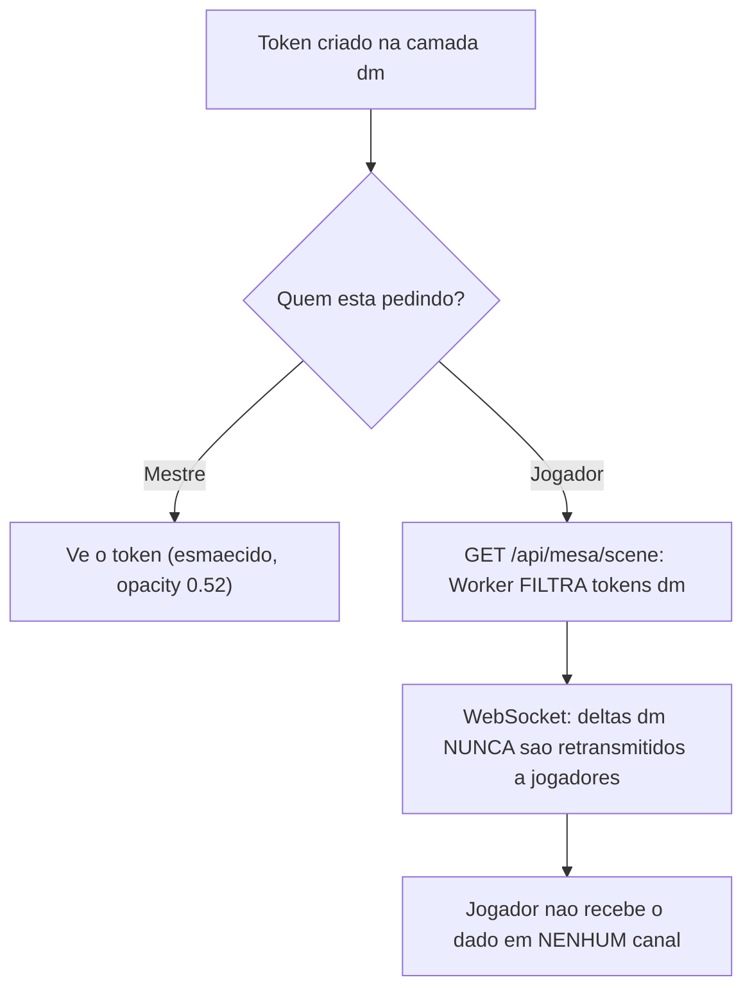
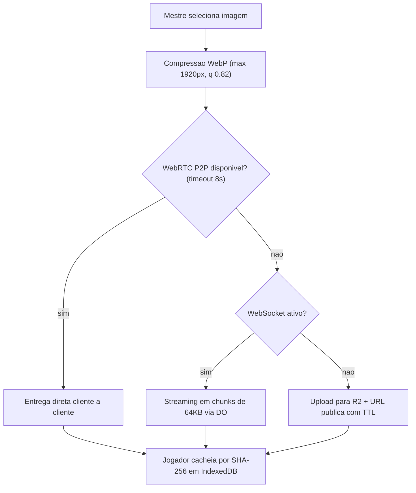
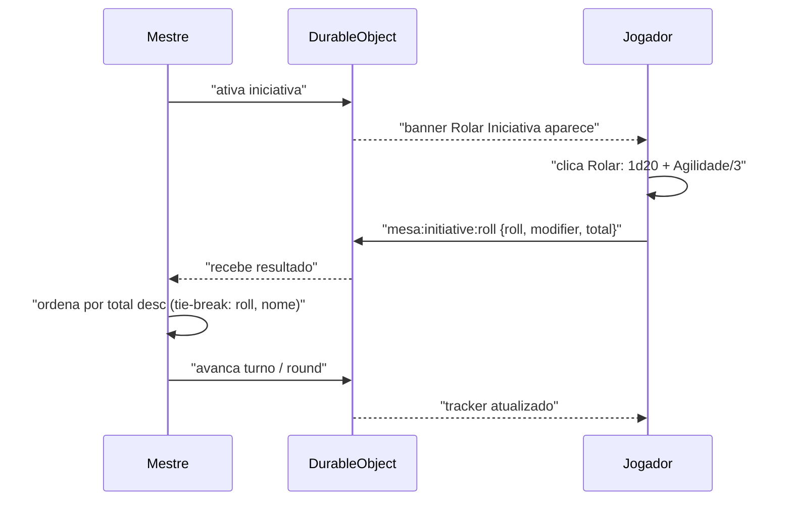
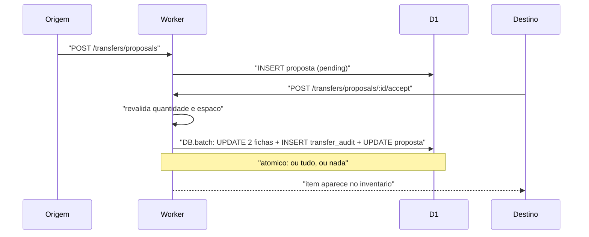
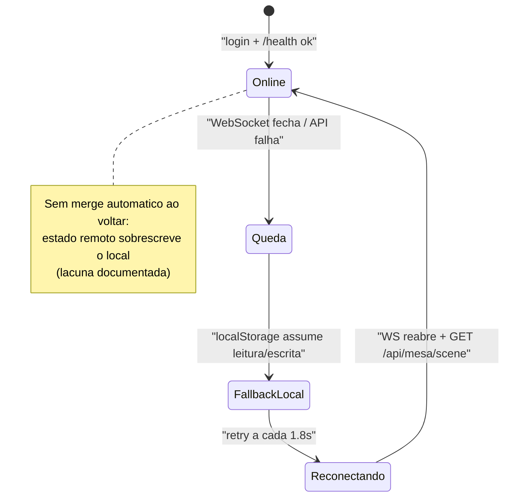
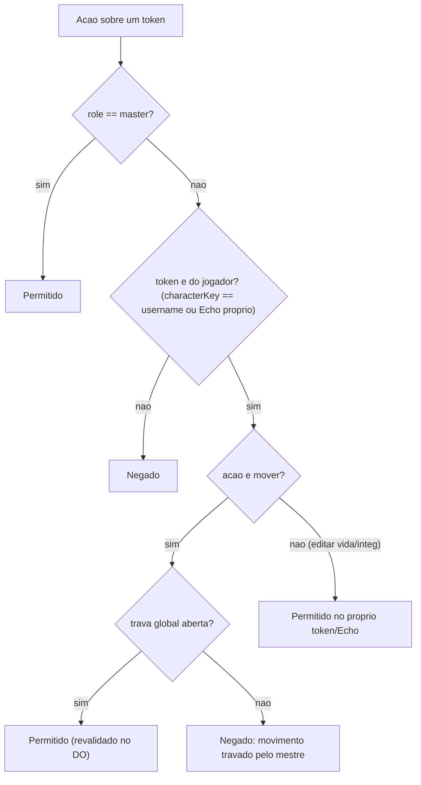

# Comparativo Técnico — Armagedom (Mesa Virtual) × Roll20

> **Data:** 2026-07-05 · **Escopo:** compara o **código atual** do repositório `rpg-campaign-git-sync` (commit de referência `84da127`) com o **estado atual do Roll20** (pós-Jumpgate), verificado em fontes oficiais na data de acesso. Onde a documentação interna do projeto diverge do código, este documento segue o código (ver §10).
>
> **Nota de renderização:** os diagramas Mermaid renderizam no github.com, VS Code e Obsidian; **não** renderizam no GitHub Pages padrão (Jekyll).

---

## 1. Resumo executivo

- **Escore geral de similaridade: ≈ 51%** (58 sub-itens em 6 categorias ponderadas; metodologia na §2). Similaridade ≠ qualidade: vários zeros são escolha de escopo.
- **Onde o Armagedom já compete de igual para igual:** infraestrutura de sync/permissões (autorização dupla UI + Durable Object, ACKs, validação server-side), vínculo token↔ficha em tempo real, camada secreta do mestre, zoom/pan/seleção/desenho, e o conjunto ficha + painel do mestre.
- **As 3 maiores lacunas** (por peso × gap): **(1) Fog of War** — categoria Visão/segredo está em 25%, e no Roll20 o fog manual é gratuito; **(2) rolagem de dados na mesa** — Automação está em 26%: não existe rolagem pública nem secreta, e o dado da ficha é privado ao navegador; **(3) grade funcional** — sem snap-to-grid nem escala de medição (grid atual é só decorativo).
- **Os 3 maiores diferenciais sobre o Roll20:** segredo do mestre **garantido no servidor** (tokens `dm` nunca chegam ao cliente do jogador), **fallback offline** em localStorage, e o **sistema da casa nativo** (Echos com drop/rank/XP, Núcleo da Alma, transferências atômicas auditadas) — que no Roll20 exigiria sheet custom + Mod scripts do plano Pro.
- **Roadmap sugerido (§9.2):** executando as 5 primeiras prioridades (fog, rolagem na mesa, snap-to-grid, rolagem da ficha transmitida, export/snapshot), o escore estimado sobe para **~70%**.
- **Aviso:** a documentação interna tem 3 pontos desatualizados em relação ao código (renderer DOM vs Canvas, backend "congelado" vs API deployada) — detalhados na §10.

---

## 2. Metodologia

**Escala de nota por sub-item, aplicada às duas plataformas:**

| Nota | Significado | Qualidade |
|---|---|---|
| 0 | Ausente | — |
| 1 | Parcial/rudimentar | Baixa |
| 2 | Funcional e utilizável em sessão real | Média |
| 3 | Completo/robusto | Alta |

**Cobertura por sub-item:** `cobertura = min(Armagedom ÷ Roll20, 1)` — com teto em 100%: superioridade pontual do Armagedom não infla o escore de similaridade (vira observação qualitativa).

**Diferenciais:** sub-itens em que Roll20 = 0 e Armagedom > 0 saem do denominador e são listados à parte (§5.2) — não faz sentido medir "similaridade com o Roll20" em algo que o Roll20 nem tenta fazer.

**Não documentado (ND):** afirmações sobre o Roll20 sem fonte oficial encontrável (ex.: comportamento interno de servidores) ficam **fora da pontuação**, marcadas como informativas.

**Agregação:** média simples dos sub-itens dentro de cada categoria (os pesos já foram definidos por categoria; sub-pesos criariam dupla ponderação).

**Escore geral:** `Σ(peso × cobertura da categoria) ÷ Σ(pesos) × 100`, com pesos definidos pelo mestre da campanha:

| Categoria | Peso |
|---|---|
| C1 Núcleo tático da mesa | 5 |
| C5 Fichas e conteúdo | 5 |
| C2 Visão e segredo | 4 |
| C3 Automação de jogo | 4 |
| C7 Infra, segurança e permissões | 4 |
| C6 Plataforma e robustez | 2 |
| C4 Comunicação na mesa | **0 — informativa, fora da pontuação** |

Σ pesos considerados = **24**.

**Política de fontes:** afirmações sobre o Roll20 citam prioritariamente o Help Center oficial (`help.roll20.net`) e o blog oficial; a wiki (`wiki.roll20.net`) é comunitária e aparece marcada como tal. Todas com data de acesso 2026-07-05, listadas em §11. Fatos sobre o Armagedom citam arquivo do repositório.

**Aviso de leitura:** o escore mede **similaridade de funcionalidades com o Roll20**, não qualidade absoluta. O Roll20 é um SaaS multi-campanha com 13+ anos de desenvolvimento; o Armagedom é um portal privado de 1 sala feito sob medida para um sistema próprio. Vários "0" do Armagedom são escolhas de escopo (ex.: chat — o grupo usa Discord), não defeitos.

---

## 3. Checklist de funcionalidades por categoria

### 3.1 C1 — Núcleo tático da mesa (peso 5)

| # | Sub-item | Roll20 | Armagedom | Observação |
|---|---|---|---|---|
| 1.1 | Múltiplas páginas/cenas | **3** — páginas ilimitadas, Player Ribbon arrastável, split the party, Page Folders[^4][^5] | **0** — mapa único por sessão (`mesa-map.js`, `MESA_MAP_ACTIVE_KEY`) | Maior lacuna estrutural do núcleo |
| 1.2 | Fundo de mapa (upload/entrega) | **3** — Art Library, upload por plano, alinhamento de mapa[^30] | **2** — upload WebP (máx 1920px, q 0.82), entrega WebRTC P2P → WS chunked 64KB → R2, cache SHA-256 em IndexedDB (`mesa-map.js`) | Entrega P2P é sofisticada; falta biblioteca de assets e multi-mapa |
| 1.3 | Grade configurável | **3** — 70px/unidade, quadrada/hex H/hex V, escala (5 ft default, ft/m/km/mi), 4 regras de diagonal, cor/opacidade[^3] | **1** — grid decorativo fixo de 88px em CSS, sem tipos, sem escala, sem medição (`mesa-stage.css`) | Sem isométrica nativa em nenhum dos dois |
| 1.4 | Snap-to-grid | **3** — snap padrão; Alt desativa temporariamente[^8] | **0** — posição livre em % (`mesa-stage.js`) | |
| 1.5 | Criação/edição de tokens | **3** — qualquer imagem no Objects Layer vira token; menu radial[^8] | **2** — tokens nascem do roster de fichas (`addTokenToStage`, `mesa-stage.js:1649`); sem token avulso de imagem arbitrária | Modelo do Armagedom é mais estruturado, porém menos flexível |
| 1.6 | Barras de status | **3** — 3 barras vinculáveis a atributos, sync bidirecional[^8] | **2** — 2 barras (Vida/Integridade) vinculadas à ficha, com visibilidade configurável por token (`statsVisibleToPlayers`) | Visibilidade por token é um plus do Armagedom |
| 1.7 | Auras e marcadores de status | **3** — 2 auras (círculo/quadrado, cor) + 40+ markers + dots[^8] | **1** — apenas badges de tipo (player/npc/monster/echo) e "Oculto"/"Mestre" | Sem marcadores de condição configuráveis |
| 1.8 | Escala e rotação de token | **3** — resize com snap + rotação livre[^8] | **2** — escala 1–3 via handle (`canResizeToken`); **sem rotação** | |
| 1.9 | Camadas | **3** — Map, Objects & Tokens, GM Info Overlay, Dynamic Lighting e Foreground[^6][^7] | **2** — 3 camadas (`tokens`, `dm`, `map` via `data-active-layer`); camada map aceita só o fundo, não objetos múltiplos | Ver §3.2 para a força real da camada `dm` |
| 1.10 | Zoom e pan | **3** — zoom/pan nativos | **3** — 25–300% (slider + botões), pan por RMB/espaço, CSS transform (`mesa-map.js`, `_stageZoom`) | Comparável |
| 1.11 | Seleção múltipla | **3** — rubber-band, grupo | **3** — rubber-band + caixa com 8 handles + multi-seleção de tokens e traços (`mesa-select.js`) | Comparável |
| 1.12 | Ferramentas de desenho | **3** — desenho livre, formas, texto | **2** — lápis/linha/retângulo/elipse/borracha, 12 cores, 3 espessuras, Ctrl+Z por camada, coordenadas em frações 0–1 (`mesa-drawing.js`) | Falta ferramenta de texto |
| 1.13 | Vínculo token ↔ ficha | **3** — "Represents" + barras linkadas[^8] | **3** — bidirecional em tempo real via `mesa:sheet:patch` (edição no token reflete na ficha e vice-versa) | Comparável; Armagedom valida ownership no servidor |
| 1.14 | Controle de movimento | **3** — "Controlled By" por token[^24] | **3** — ownership por token + trava global do mestre (`playersMoveLocked`, persistida no Durable Object) | Trava global não existe nativamente no Roll20 |

**Cobertura C1 = 0,62** (8,67 ÷ 14)

### 3.2 C2 — Visão e segredo (peso 4)

| # | Sub-item | Roll20 | Armagedom | Observação |
|---|---|---|---|---|
| 2.1 | Fog of War manual | **3** — "Hide/Reveal Mask", **grátis para todos**, retângulo + polígono, hide/reveal/página inteira[^9][^10] | **0** — inexistente (FASE 4 planejada em `mesa-map.js`, não implementada) | Lacuna nº 1 da categoria — e no Roll20 é recurso gratuito |
| 2.2 | Iluminação dinâmica / linha de visão | **3** — requer Plus/Pro (só o criador), barreiras/portas/janelas, "Update on Drop"[^11][^13] | **0** — inexistente | |
| 2.3 | Visão por token | **3** — visão, night/nocturnal vision com dimming, luz emitida[^12] | **0** — inexistente | |
| 2.4 | Camada secreta do GM | **3** — GM Info Overlay[^6] | **3** — camada `dm`: tokens e desenhos invisíveis a jogadores; mestre vê esmaecido (opacity 0.52) | Paridade funcional |
| 2.5 | Garantia server-side do segredo | **ND** — modelo de entrega de dados ocultos não documentado publicamente | **Fato de código** — tokens `dm` são filtrados no `GET /api/mesa/scene` e **nunca** retransmitidos a jogadores pelo Durable Object (`cloudflare/src/index.js`, `mesa-realtime.js`) | **Diferencial do Armagedom** — o segredo não depende do cliente |

**Cobertura C2 = 0,25** (1,00 ÷ 4 pontuáveis)

### 3.3 C3 — Automação de jogo (peso 4)

| # | Sub-item | Roll20 | Armagedom | Observação |
|---|---|---|---|---|
| 3.1 | Rolagem pública na mesa | **3** — /roll no chat, visível a todos, 3D dice[^14] | **0** — nenhuma rolagem geral dentro da mesa | O dado da ficha é privado ao navegador (ver 5.3) |
| 3.2 | Sintaxe de expressões de dados | **3** — Dice Reference: kh/kl, explosão, reroll, sucessos, cs/cf[^15] | **2** — d4–d100, expressão custom XdY+Z, modificador, vantagem/desvantagem, crítico/fumble (`ficha-dice.js`) | Cobre o sistema da casa; sem keep/drop/explosão genéricos |
| 3.3 | Rolagem secreta do GM | **3** — /gmroll, /w gm[^14] | **0** — inexistente | |
| 3.4 | Macros e token actions | **3** — Collections, quickbar, Abilities, Token Actions contextuais[^17] | **0** — inexistente | |
| 3.5 | Turn tracker | **3** — itens custom, Round Calculation ±1, @{tracker}[^16] | **2** — tracker do mestre com rounds e avanço de turno (`mesa-initiative.js`); sem itens custom/contadores | |
| 3.6 | Rolagem de iniciativa integrada | **3** — via ficha/macro + &{tracker}[^16] | **3** — banner para o jogador rolar 1d20 + Agilidade/3 com 1 clique, ordenação automática por total (`mesa-initiative.js:199-217`) | UX do Armagedom é mais direta que a do Roll20 para o sistema da casa |
| 3.7 | Tabelas roláveis | **3** — Collections, loot/críticos, table tokens[^18] | **0** — inexistente | Único gerador aleatório server-side: drop de memórias/Echos de monstro (`/transfers/memories/monster-roll`) |
| 3.8 | Decks de cartas | **3** — deck 54 padrão + custom, mãos, mesa[^18] | **0** — inexistente | |
| 3.9 | Automação programável | **3** — Mod Scripts (API) Pro, sandbox server-side, state persistente[^20][^21] | **0** — inexistente | |

**Cobertura C3 = 0,26** (2,33 ÷ 9)

### 3.4 C4 — Comunicação na mesa (peso 0 — informativa, fora da pontuação)

O grupo joga com Discord; estes itens ficam registrados apenas para completude do retrato.

| # | Sub-item | Roll20 | Armagedom |
|---|---|---|---|
| 4.1 | Chat de texto | **3** — persistente, com rolagens[^14] | **0** |
| 4.2 | Sussurro (/w) | **3**[^14] | **0** |
| 4.3 | Ping no mapa | **3** — via select tool, visível a todos[^27] | **0** |
| 4.4 | Régua/medição | **3** — waypoints (Q), unidades da página, token segue trajeto[^27] | **0** |
| 4.5 | Áudio/vídeo integrado | **2** — WebRTC P2P (~5 pessoas confortável)[^29] | **0** |
| 4.6 | Emotes/falar como personagem | **3** — /em, "Speak As"[^14][^24] | **0** |
| 4.7 | Jukebox/áudio ambiente | **3** — independente do A/V[^29] | **0** |

### 3.5 C5 — Fichas e conteúdo (peso 5)

| # | Sub-item | Roll20 | Armagedom | Observação |
|---|---|---|---|---|
| 5.1 | Fichas estruturadas | **3** — sheets por sistema + Charactermancer[^23] | **3** — ficha nativa do sistema: 5 atributos, Vida, Integridade, Núcleo da Alma (rank 1–7/XP/pesadelos), habilidades (id/name/type/trigger/desc), passivas, memórias (`ficha-core.js`, `cloudflare/src/sheet.js`) | Feita sob medida — cobre 100% do sistema da casa |
| 5.2 | Edição total pelo mestre | **3** — GM edita tudo | **3** — painel do mestre: criar/remover jogadores, NPCs e monstros; editar qualquer ficha (`ficha-master.js`) | Comparável |
| 5.3 | Rolagem a partir da ficha | **3** — botões da sheet rolam no chat, visíveis à mesa[^23] | **1** — dice tray privado ao navegador; sem rolar direto de atributo; sem transmissão (`ficha-dice.js`) | O resultado não chega aos outros jogadores |
| 5.4 | Inventário estruturado | **2** — depende da sheet; genérico | **3** — slots com capacidade, tipos (arma/armadura/acessório), dano, mitigação de armadura, equipar (`ficha-inventory.js`) | Armagedom superior (cap em 100%) |
| 5.5 | Transferência de itens com auditoria | **1** — não nativo (manual ou via Mod scripts Pro) | **3** — propostas com aceite, efetivação atômica em `DB.batch`, auditoria imutável em `transfer_audit` (`cloudflare/src/index.js`) | Armagedom superior (cap em 100%) |
| 5.6 | Companheiros vinculados com progressão | **1** — possível manualmente (ficha extra) | **3** — Echos: drop de monstro, rank 1–7, XP com limites por rank, invocação na mesa, transferência com consentimento (`echos`, D1) | Armagedom superior (cap em 100%) |
| 5.7 | Progressão/XP automatizada | **1** — depende de sheetworkers por sistema | **3** — Núcleo da Alma: essência, saturação, pesadelos, ganho de atributos com tetos por rank, auditado em `soul_audit` | Armagedom superior (cap em 100%) |
| 5.8 | Compêndio/regras integrado | **3** — compêndios licenciados pesquisáveis, drag-and-drop[^23] | **1** — `regras.html`: posts de regras do mestre, sem busca, sem tags navegáveis | |
| 5.9 | Handouts/notas compartilhadas | **3** — handouts com imagem e permissão por jogador[^24] | **0** — inexistente | |
| 5.10 | Import/export de personagem | **3** — Roll20 Characters (ex-Vault); nuance: jogo free aceita só 3 exports[^19] | **0** — sem export/import JSON de ficha ou cena | |
| 5.11 | Conteúdo pronto/marketplace | **3** — marketplace, módulos | **0** — estruturalmente N/A (sistema próprio), mas contado por honestidade | |
| 5.12 | Permissões por personagem | **3** — "In Player's Journals" + "Can Be Edited & Controlled By"[^24] | **2** — ownership binário (dono edita a própria; mestre tudo), validado no Worker e no DO; sem separar "ver" de "editar" | |
| 5.13 | Avatares/arte | **3** — Art Library com cotas por plano[^30] | **2** — upload R2 (webp/jpeg, máx 2MB), avatar por personagem e por Echo; sem biblioteca | |

**Cobertura C5 = 0,62** (8,00 ÷ 13)

### 3.6 C6 — Plataforma e robustez (peso 2)

| # | Sub-item | Roll20 | Armagedom | Observação |
|---|---|---|---|---|
| 6.1 | Mobile/touch | **2** — app delistado (fev/2026); navegador móvel recomendado; fichas otimizadas, tabletop completo fraco em phone[^25][^26] | **1** — responsivo até 480px, mas mesa usa só mouse events (sem touch handlers dedicados) | Nenhum dos dois resolve bem o tabletop em celular |
| 6.2 | Offline/local | **0** — exige conexão | **2** — fallback completo em localStorage quando a API cai; sem merge ao reconectar | **Diferencial do Armagedom** (fora da fórmula) |
| 6.3 | Desempenho de renderização | **2** — Jumpgate melhorou (60 FPS default)[^1] | **2** — DOM renderer leve, render incremental por assinatura, limite de 120 tokens validado no Worker | Escalas diferentes, ambos adequados ao uso |
| 6.4 | Acessibilidade | **1** — limitada | **1** — aria parcial, `prefers-reduced-motion`, contraste AA no texto principal; steppers 30px < 44px | Empate em "parcial" |
| 6.5 | Compatibilidade de navegadores | **3** — Chrome/Firefox/Edge suportados oficialmente | **2** — funciona nos navegadores modernos; sem matriz de teste formal | |
| 6.6 | Peso/otimização de assets | **2** — assets pesados, cotas por plano[^30] | **3** — WebP, minify CSS/JS, cache-busting `?v=`, sem bundler, `audit:static` valida referências | Armagedom superior (cap em 100%) |

**Cobertura C6 = 0,83** (4,17 ÷ 5 pontuáveis)

### 3.7 C7 — Infra, segurança e permissões (peso 4)

| # | Sub-item | Roll20 | Armagedom | Observação |
|---|---|---|---|---|
| 7.1 | Autenticação | **3** — contas da plataforma | **3** — JWT HS256 (7 dias), PBKDF2 25k + salt/usuário + pepper, migração transparente de sha256 legado, throttle de login 8 falhas/10 min (`cloudflare/src/auth.js`) | Comparável para o escopo |
| 7.2 | Recuperação de senha | **3** — fluxo de conta padrão | **0** — mestre reseta manualmente | |
| 7.3 | Papéis e granularidade | **2** — GM/jogador binário + campos por personagem[^24] | **2** — master/player binário + ownership por recurso | Empate |
| 7.4 | Sincronização em tempo real | **3** — sync da plataforma | **3** — WebSocket via Durable Object: ~20 tipos de mensagem, ACKs com `messageId`, broadcast segmentado (todos/mestres/audiência da ficha), reconexão 1.8s (`mesa-realtime.js`, `js/api.js`) | Comparável |
| 7.5 | Persistência + validação server-side | **3** — persistência da plataforma | **3** — D1 como fonte de verdade; `PUT /mesa/scene` valida 120 tokens, posição 0–100, escala 0.25–4; normalização de ficha preserva campos e clampa recursos (`sheet.js`) | Comparável |
| 7.6 | Resolução de conflitos | **2** — last-write-wins com sync contínuo | **1** — last-write-wins; `PUT` de ficha sem versionamento/locking otimista pode sobrescrever edição concorrente | Janela otimista no cliente mitiga parcialmente |
| 7.7 | Auditoria imutável | **0** — sem log de auditoria exposto ao GM | **2** — `transfer_audit` + `soul_audit` imutáveis; sem audit de edição de ficha | **Diferencial do Armagedom** (fora da fórmula) |
| 7.8 | Rate limiting além do login | **ND** — não documentado | **1** — só no login | Informativo (fora da fórmula) |
| 7.9 | Tolerância a falhas/degradação | **2** — reconexão da plataforma | **2** — fallback localStorage, reconexão automática, trava de movimento persistida no storage do DO (sobrevive à hibernação) | Empate |
| 7.10 | Snapshots/backup/versionamento | **2** — personagens via Vault; jogos persistem na plataforma | **0** — sem snapshot de cena nem histórico de ficha | |
| 7.11 | Multi-salas/campanhas | **3** — jogos ilimitados por conta | **0** — Durable Object único, sala `default` | |

**Cobertura C7 = 0,61** (5,50 ÷ 9 pontuáveis)

---

## 4. Matriz consolidada de recursos

Visão de varredura rápida (justificativas na §3). Legenda: nota 0–3; `DIF` = diferencial do Armagedom (fora da fórmula); `ND` = não documentado no Roll20 (fora da fórmula); `INF` = categoria informativa (peso 0).

| Cat. | # | Sub-item | R20 | Arm | Situação |
|---|---|---|---|---|---|
| C1 | 1.1 | Múltiplas páginas/cenas | 3 | 0 | Lacuna |
| C1 | 1.2 | Fundo de mapa | 3 | 2 | Parcial |
| C1 | 1.3 | Grade configurável | 3 | 1 | Lacuna |
| C1 | 1.4 | Snap-to-grid | 3 | 0 | Lacuna |
| C1 | 1.5 | Criação/edição de tokens | 3 | 2 | Parcial |
| C1 | 1.6 | Barras de status | 3 | 2 | Parcial |
| C1 | 1.7 | Auras e marcadores | 3 | 1 | Lacuna |
| C1 | 1.8 | Escala e rotação | 3 | 2 | Parcial |
| C1 | 1.9 | Camadas | 3 | 2 | Parcial |
| C1 | 1.10 | Zoom e pan | 3 | 3 | Paridade |
| C1 | 1.11 | Seleção múltipla | 3 | 3 | Paridade |
| C1 | 1.12 | Ferramentas de desenho | 3 | 2 | Parcial |
| C1 | 1.13 | Vínculo token↔ficha | 3 | 3 | Paridade |
| C1 | 1.14 | Controle de movimento | 3 | 3 | Paridade |
| C2 | 2.1 | Fog of War manual | 3 | 0 | **Lacuna crítica** |
| C2 | 2.2 | Iluminação dinâmica | 3 | 0 | Lacuna |
| C2 | 2.3 | Visão por token | 3 | 0 | Lacuna |
| C2 | 2.4 | Camada secreta do GM | 3 | 3 | Paridade |
| C2 | 2.5 | Segredo server-side | ND | — | **DIF** |
| C3 | 3.1 | Rolagem pública na mesa | 3 | 0 | **Lacuna crítica** |
| C3 | 3.2 | Sintaxe de dados | 3 | 2 | Parcial |
| C3 | 3.3 | Rolagem secreta do GM | 3 | 0 | Lacuna |
| C3 | 3.4 | Macros/token actions | 3 | 0 | Lacuna |
| C3 | 3.5 | Turn tracker | 3 | 2 | Parcial |
| C3 | 3.6 | Iniciativa integrada | 3 | 3 | Paridade |
| C3 | 3.7 | Tabelas roláveis | 3 | 0 | Lacuna |
| C3 | 3.8 | Decks de cartas | 3 | 0 | Lacuna |
| C3 | 3.9 | Automação programável | 3 | 0 | Lacuna |
| C4 | 4.1–4.7 | Chat, sussurro, ping, régua, A/V, emotes, jukebox | 2–3 | 0 | INF (peso 0) |
| C5 | 5.1 | Fichas estruturadas | 3 | 3 | Paridade |
| C5 | 5.2 | Edição total pelo mestre | 3 | 3 | Paridade |
| C5 | 5.3 | Rolagem a partir da ficha | 3 | 1 | Lacuna |
| C5 | 5.4 | Inventário estruturado | 2 | 3 | **Arm superior** |
| C5 | 5.5 | Transferências auditadas | 1 | 3 | **Arm superior** |
| C5 | 5.6 | Companheiros (Echos) | 1 | 3 | **Arm superior** |
| C5 | 5.7 | Progressão automatizada | 1 | 3 | **Arm superior** |
| C5 | 5.8 | Compêndio/regras | 3 | 1 | Lacuna |
| C5 | 5.9 | Handouts | 3 | 0 | Lacuna |
| C5 | 5.10 | Import/export | 3 | 0 | Lacuna |
| C5 | 5.11 | Marketplace | 3 | 0 | Lacuna (N/A estrutural) |
| C5 | 5.12 | Permissões por personagem | 3 | 2 | Parcial |
| C5 | 5.13 | Avatares/arte | 3 | 2 | Parcial |
| C6 | 6.1 | Mobile/touch | 2 | 1 | Parcial |
| C6 | 6.2 | Offline/local | 0 | 2 | **DIF** |
| C6 | 6.3 | Desempenho | 2 | 2 | Paridade |
| C6 | 6.4 | Acessibilidade | 1 | 1 | Paridade |
| C6 | 6.5 | Navegadores | 3 | 2 | Parcial |
| C6 | 6.6 | Otimização de assets | 2 | 3 | **Arm superior** |
| C7 | 7.1 | Autenticação | 3 | 3 | Paridade |
| C7 | 7.2 | Recuperação de senha | 3 | 0 | Lacuna |
| C7 | 7.3 | Papéis | 2 | 2 | Paridade |
| C7 | 7.4 | Sync tempo real | 3 | 3 | Paridade |
| C7 | 7.5 | Persistência/validação | 3 | 3 | Paridade |
| C7 | 7.6 | Conflitos | 2 | 1 | Parcial |
| C7 | 7.7 | Auditoria imutável | 0 | 2 | **DIF** |
| C7 | 7.8 | Rate limiting | ND | 1 | ND |
| C7 | 7.9 | Tolerância a falhas | 2 | 2 | Paridade |
| C7 | 7.10 | Snapshots/backup | 2 | 0 | Lacuna |
| C7 | 7.11 | Multi-salas | 3 | 0 | Lacuna |

---

## 5. Pontuação ponderada

### 5.1 Escore por categoria

| Categoria | Peso | Cobertura | Peso × Cobertura | Contribuição no escore |
|---|---|---|---|---|
| C1 Núcleo tático | 5 | 0,62 (8,67/14) | 3,10 | 12,9% |
| C5 Fichas e conteúdo | 5 | 0,62 (8,00/13) | 3,08 | 12,8% |
| C2 Visão e segredo | 4 | 0,25 (1,00/4) | 1,00 | 4,2% |
| C3 Automação | 4 | 0,26 (2,33/9) | 1,04 | 4,3% |
| C7 Infra/segurança | 4 | 0,61 (5,50/9) | 2,44 | 10,2% |
| C6 Plataforma | 2 | 0,83 (4,17/5) | 1,67 | 6,9% |
| C4 Comunicação | 0 | — (informativa) | — | — |
| **Escore geral** | **24** | | **12,32 ÷ 24** | **≈ 51%** |

**Leitura:** o Armagedom cobre hoje cerca de **metade** do que o Roll20 oferece nas categorias que importam para esta campanha. A cobertura é **desigual por desenho**: forte onde o projeto investiu (infra de sync/permissões ≈ 61%, fichas ≈ 62%, núcleo da mesa ≈ 62%, plataforma ≈ 83%) e fraca nas duas categorias de "linguagem de mesa" que o projeto ainda não atacou — **visão/segredo (25%)** e **automação (26%)**, justamente com peso 4.

### 5.2 Diferenciais do Armagedom (fora da fórmula)

Recursos onde o Roll20 não compete — excluídos do denominador para não inflar a similaridade:

1. **Segredo garantido no servidor** (2.5) — tokens da camada `dm` nunca chegam ao cliente do jogador, nem por REST nem por WebSocket. No Roll20 esse modelo não é documentado publicamente.
2. **Fallback offline em localStorage** (6.2) — a mesa e as fichas continuam operáveis com a API fora do ar; o Roll20 exige conexão.
3. **Auditoria imutável de transferências e progressão** (7.7) — `transfer_audit` e `soul_audit` registram quem fez o quê; o Roll20 não expõe auditoria ao GM.
4. **Sistema da casa nativo** (pontuado em 5.4–5.7, com cap) — inventário com capacidade/armadura, transferências com consentimento atômicas (`DB.batch`), Echos com drop/rank/XP e Núcleo da Alma com pesadelos: no Roll20 isso exigiria sheet custom + Mod scripts (Pro).
5. **Entrega de mapa em 3 vias** (dentro de 1.2) — WebRTC P2P → WebSocket chunked → R2, com cache SHA-256 no jogador.

---

## 6. Modelagem de interações

### 6.1 Arquitetura lado a lado

O Armagedom separa REST (persistência via Worker → D1/R2) de tempo real (Durable Object). O Roll20 é descrito como caixa observável — os internals não são documentados publicamente.

**Comparação:** nos dois, o servidor é autoritativo. A diferença estrutural é escala: o Roll20 multiplexa milhares de jogos; o Armagedom dedica 1 Durable Object à única sala — mais simples, e é também o teto atual (§7, escalabilidade).

### 6.2 Sequência: movimento de token (Armagedom)

**Comparação:** o fluxo do Roll20 é análogo (cliente → sync → demais clientes), com autorização por "Controlled By". No Armagedom há uma nuance: o delta em tempo real é retransmitido pelo DO, mas a **persistência** da cena é exclusiva do mestre — um jogador movendo o próprio token depende do mestre para o estado ficar gravado no D1.

### 6.3 Fluxo de segredo do mestre

**Comparação:** o GM Info Overlay do Roll20 cumpre o mesmo papel de UX. A garantia do Armagedom é verificável no código do servidor; o modelo do Roll20 para dados ocultos não é documentado publicamente.

### 6.4 Cadeia de entrega de mapa (Armagedom)

**Comparação:** o Roll20 serve mapas de CDN própria com cotas por plano (Free 100MB de storage)[^30]. O Armagedom evita custo de storage priorizando P2P — mais engenhoso, porém com mais partes móveis para falhar.

### 6.5 Sequência: iniciativa

**Comparação:** no Roll20 o jogador rola pela ficha/macro e o resultado entra no Turn Tracker via `&{tracker}`[^16] — mais flexível, porém exige configuração. O fluxo do Armagedom é de 1 clique, já com a regra da casa embutida.

### 6.6 Sequência: transferência de item (Armagedom)

**Comparação:** sem equivalente nativo no Roll20 (seria manual ou Mod script). É um dos diferenciais listados em §5.2.

### 6.7 Estados de conexão do cliente (Armagedom)

**Comparação:** o Roll20 não degrada para modo local — sem conexão, sem jogo. Em compensação, ao reconectar não há risco de perder edições feitas offline, risco que existe no Armagedom (item 7.6).

### 6.8 Árvore de autorização da Mesa (Armagedom)

**Comparação:** equivalente ao "Controlled By" do Roll20[^24], com duas diferenças: a trava global de movimento (sem equivalente nativo no Roll20) e a dupla validação — a permissão é checada na UI **e** revalidada no Durable Object antes do relay.

---

## 7. Requisitos não-funcionais comparados

| Requisito | Roll20 | Armagedom | Avaliação |
|---|---|---|---|
| **Escalabilidade** | SaaS multi-campanha, jogos ilimitados | 1 Durable Object (sala `default`), ~centenas de WebSockets por DO — muito acima da necessidade de 1 grupo | Adequado ao escopo; multi-sala exigiria sharding de DOs |
| **Tolerância a falhas** | Reconexão da plataforma; exige conexão | Fallback localStorage (leitura e escrita), reconexão 1.8s, trava de movimento persistida no storage do DO (sobrevive à hibernação); **sem merge ao reconectar** | Armagedom degrada melhor; recuperação pior (risco de sobrescrita) |
| **Segurança** | Conta da plataforma, HTTPS | TLS (Cloudflare), JWT 7d, PBKDF2 25k + salt + pepper, throttle de login, CORS allowlist, validação de ownership no Worker **e** no DO, secrets via env | Sólido para o escopo; sem recuperação de senha, rate-limit só no login |
| **Privacidade** | Dados na plataforma Roll20 (termos deles) | Dados no Cloudflare do próprio mestre; sem terceiros | Vantagem estrutural do Armagedom |
| **Desempenho** | Jumpgate: engine nova, FPS limit 60 default[^1] | DOM renderer com render incremental, throttle de drag 50ms, mapa WebP ≤1920px, limite de 120 tokens | Ambos adequados; escalas incomparáveis |
| **Compatibilidade** | Chrome/Firefox/Edge oficiais | Navegadores modernos; sem matriz formal de teste | |
| **Offline** | Inexistente | localStorage cobre mesa e fichas | Diferencial (§5.2) |
| **Mobile** | App delistado (fev/2026); browser p/ fichas[^25][^26] | Responsivo até 480px; mesa sem touch handlers | Fraco nos dois; no Armagedom é corrigível (pointer events) |
| **Auditabilidade** | Sem auditoria exposta | `transfer_audit` + `soul_audit` imutáveis | Diferencial (§5.2) |

---

## 8. Métricas e plano de testes

### 8.1 KPIs propostos para o Armagedom

| KPI | Alvo | Como medir |
|---|---|---|
| Latência de sync de movimento (delta → outro cliente) | < 300 ms | timestamp `sentAt` dos deltas vs recepção |
| FPS durante drag de token | > 30 (sem long tasks > 50ms) | já coberto por `npm run perf:mesa` |
| Tempo de entrega de mapa por via | P2P < 3s; WS < 8s; R2 < 5s | instrumentar `mesa-map.js` |
| Tempo de reestabilização pós-queda | < 5 s (reconexão + `GET /mesa/scene`) | teste de rede simulada |
| Taxa de ACK com erro no DO | < 1% | contar `ok:false` nos ACKs |
| Tempo de carga inicial da mesa | < 3 s em rede doméstica | Playwright trace |

### 8.2 Mapa das suítes existentes

| Suíte | Testes | O que cobre (itens da matriz) |
|---|---|---|
| `tests/mesa.spec.cjs` | 5 | render DOM de tokens, drag/move (1.5, 1.14), seleção, edição Vida/Integridade no inspetor (1.13), console limpo |
| `tests/ficha.spec.cjs` | 28 | contratos de transferência/auditoria (5.5), XP do Núcleo da Alma (5.7), saturação/overflow, normalização de ficha (7.5) |
| `tests/mesa-online.spec.cjs` | 3 | site publicado + API, proteção anônima (7.1), sync mestre/jogador em 2 abas (7.4) |
| `tests/mesa.performance.spec.cjs` | 1 | drag DOM sem long tasks (6.3) |
| `npm run check:js` / `audit:static` | — | sintaxe dos 39 JS; referências, cache-busting `?v=`, IDs duplicados |

### 8.3 Lacunas de teste

1. **Touch/mobile** — nenhum teste simula toque na mesa (item 6.1).
2. **Reconexão + consistência** — nenhum teste derruba o WebSocket e valida o estado após reconectar (7.6/7.9 — justamente onde há risco de sobrescrita).
3. **Mais de 2 clientes simultâneos** — o smoke online usa mestre + 1 jogador.
4. **Carga de 120 tokens** — o limite do `PUT /mesa/scene` nunca é exercitado.
5. **Cadeia de mapa** — os ramos WS chunked e R2 do diagrama 6.4 não têm teste.
6. **Permissões negativas sistemáticas** — falta uma suíte que tente cada rota master-only como jogador e espere 403 (hoje é pontual).
7. **Acessibilidade automatizada** — sem axe/lighthouse no CI.

---

## 9. Conclusão e roadmap

### 9.1 Semelhanças cruciais

- **Servidor autoritativo** com sync em tempo real via WebSocket nos dois sistemas; no Armagedom com ACKs e broadcast segmentado.
- **Camada secreta do GM** em paridade funcional (GM Info Overlay ↔ camada `dm`) — e no Armagedom com garantia server-side.
- **Vínculo token ↔ ficha** bidirecional nos dois; barras de vida sincronizadas.
- **Modelo de permissões** por controle/ownership de personagem, com GM/mestre onipotente.
- **Núcleo de manipulação** (zoom/pan, multi-seleção, desenho por camada, turn tracker) comparável.

### 9.2 Lacunas priorizadas (peso da categoria × tamanho do gap)

| Prioridade | Lacuna | Categoria (peso) | Por quê |
|---|---|---|---|
| 1 | **Fog of War manual** | C2 (4) | Categoria com pior cobertura (25%); no Roll20 é recurso **gratuito**; a infraestrutura de máscara pode reusar o modelo de desenhos em frações 0–1 |
| 2 | **Rolagem pública na mesa + rolagem secreta do mestre** | C3 (4) | Segunda pior cobertura (26%); o motor de dados já existe em `ficha-dice.js` — falta um tipo de delta (`mesa:roll`) e um painel de resultados |
| 3 | **Snap-to-grid + grade com escala** | C1 (5) | Peso máximo; o grid visual já existe (88px) — falta encaixe opcional e medida por célula |
| 4 | **Rolagem a partir da ficha transmitida à mesa** | C5 (5) | Transforma o item 5.3 de 1→3 reaproveitando a prioridade 2 |
| 5 | **Export/import JSON + snapshot de cena** | C5/C7 | Mitiga também 7.10 (backup); barato: a cena já é JSON serializado |
| 6 | **Handouts simples** | C5 (5) | Estender `regras.html` com imagem + visibilidade por jogador |
| 7 | **Múltiplas cenas** | C1 (5) | Estrutural: exige `scene_id` no D1 (hoje fixo em `default`) e UI de troca |
| 8 | **Marcadores de condição nos tokens** | C1 (5) | Pequeno: badges já existem, faltam markers configuráveis |
| 9 | **Touch/pointer events na mesa** | C6 (2) | Trocar mouse events por Pointer Events cobre mouse + toque de uma vez |
| 10 | **Versionamento otimista de ficha** | C7 (4) | `sceneVersion` já existe para cena; aplicar o mesmo padrão ao `PUT /characters` |

Macros, tabelas roláveis, cartas e API de scripts (C3) ficam fora do top 10 conscientemente: são caros e o sistema da casa já embute as automações que importam (iniciativa, XP, drops).

### 9.3 Meta de escore

Executando as prioridades 1–5, a cobertura estimada sobe: C2 0,25→0,75, C3 0,26→0,59, C1 0,62→0,69, C5 0,62→0,77, C7 0,61→0,67 → **escore geral de ~51% para ~70%**, mantendo os diferenciais.

---

## 10. Discrepâncias da documentação interna

Este comparativo segue **o código**. Três pontos da documentação interna estão desatualizados e merecem correção (tarefa separada):

1. **`CLAUDE.md`** — descreve o renderer como "Canvas + OffscreenCanvas Worker por padrão (`mesa-renderer-v2.js` / `mesa-renderer-worker.js`), fallback DOM via `localStorage.mesaRenderer`". O commit `84da127` removeu o Canvas renderer morto: a mesa atual renderiza tokens **100% em DOM** (canvas só para desenhos, `#mesaDrawCanvas`).
2. **`docs/obsidian/07-MESA.md`** (linhas ~120–121) — mesma afirmação desatualizada ("O palco usa Canvas/Worker por padrão…"), além de listar `mesa-renderer-v2.js`/`mesa-renderer-worker.js` como arquivos principais.
3. **`DEV_STATUS.md`** — declara "backend congelado no commit `aee08e0`, NÃO rodar `wrangler deploy`", mas a API está deployada e em uso (realtime ativo, `runtime-config.js` com `realtimeEnabled: true`). Além disso, o relay de Echo no Durable Object (Etapa do painel de Echos) **exige um `wrangler deploy` futuro** para funcionar em produção — pendência registrada no próprio DEV_STATUS.

---

## 11. Fontes

Todas acessadas em **2026-07-05**. `[oficial]` = help.roll20.net / blog oficial; `[wiki]` = comunitária.

[^1]: [oficial] Jumpgate — Roll20 Help Center — https://help.roll20.net/hc/en-us/articles/21569402281495-Jumpgate
[^3]: [oficial] Page Settings — Roll20 Help Center — https://help.roll20.net/hc/en-us/articles/360039675373-Page-Settings
[^4]: [oficial] Page Menu & Folders — Roll20 Help Center — https://help.roll20.net/hc/en-us/articles/360039675413-Page-Menu-Folders
[^5]: [wiki] Player Ribbon — Roll20 Wiki — https://wiki.roll20.net/Player_Ribbon
[^6]: [oficial] Layers — Roll20 Help Center — https://help.roll20.net/hc/en-us/articles/360039675053-Layers
[^7]: [oficial] Foreground Layer — Roll20 Help Center — https://help.roll20.net/hc/en-us/articles/30738192036887-Foreground-Layer
[^8]: [oficial] Token Features — Roll20 Help Center — https://help.roll20.net/hc/en-us/articles/360039674573-Token-Features
[^9]: [oficial] Hide / Reveal Mask (Free) — Roll20 Help Center — https://help.roll20.net/hc/en-us/articles/360051768534-Hide-Reveal-Mask-Free
[^10]: [oficial] Fog of War (Classic VTT) — Roll20 Help Center — https://help.roll20.net/hc/en-us/articles/360037774513-Fog-of-War-Classic-VTT
[^11]: [oficial] Page Settings For Dynamic Lighting — Roll20 Help Center — https://help.roll20.net/hc/en-us/articles/360052521913-Page-Settings-For-Dynamic-Lighting
[^12]: [oficial] Token Settings for Dynamic Lighting — Roll20 Help Center — https://help.roll20.net/hc/en-us/articles/360051754954-Token-Settings-for-Dynamic-Lighting
[^13]: [oficial] Creating Light, Windows, and Barriers — Roll20 Help Center — https://help.roll20.net/hc/en-us/articles/360051768974-Creating-Light-Windows-and-Barriers
[^14]: [oficial] Text Chat — Roll20 Help Center — https://help.roll20.net/hc/en-us/articles/360039675093-Text-Chat
[^15]: [wiki] Dice Reference — Roll20 Wiki — https://wiki.roll20.net/Dice_Reference
[^16]: [oficial] Turn Tracker — Roll20 Help Center — https://help.roll20.net/hc/en-us/articles/360039178634-Turn-Tracker
[^17]: [oficial] Macros & Token Actions — Roll20 Help Center — https://help.roll20.net/hc/en-us/articles/360037256794-Macros-Token-Actions
[^18]: [oficial] Collections — Roll20 Help Center — https://help.roll20.net/hc/en-us/articles/360039178754-Collections
[^19]: [oficial] Roll20 Characters — Roll20 Help Center — https://help.roll20.net/hc/en-us/articles/360037258594-Roll20-Characters
[^20]: [oficial] Introduction to Mod Scripts (API) — Roll20 Help Center — https://help.roll20.net/hc/en-us/articles/360037256714-Introduction-to-Mod-Scripts-API
[^21]: [oficial] API: Sandbox Model — Roll20 Help Center — https://help.roll20.net/hc/en-us/articles/360037772853-API-Sandbox-Model
[^23]: [oficial] Compendium — Roll20 Help Center — https://help.roll20.net/hc/en-us/articles/360039178694-Compendium
[^24]: [oficial] Journal — Roll20 Help Center — https://help.roll20.net/hc/en-us/articles/360039675133-Journal
[^25]: [oficial] Using Roll20 on Mobile Devices — Roll20 Help Center — https://help.roll20.net/hc/en-us/articles/4411213438231-Using-Roll20-on-Mobile-Devices
[^26]: [oficial] We're Retiring the Roll20 Mobile App… — Roll20 Blog — https://blog.roll20.net/posts/were-retiring-the-roll20-mobile-app-to-build-something-better-heres-why/
[^27]: [oficial] Measure Tool — Roll20 Help Center — https://help.roll20.net/hc/en-us/articles/360039674913-Measure-Tool
[^29]: [oficial] Integrated Voice and Video — Roll20 Help Center — https://help.roll20.net/hc/en-us/articles/360041544734-Integrated-Voice-and-Video
[^30]: [oficial] Best Practices for Files on Roll20 — Roll20 Help Center — https://help.roll20.net/hc/en-us/articles/360037256634-Best-Practices-for-Files-on-Roll20
